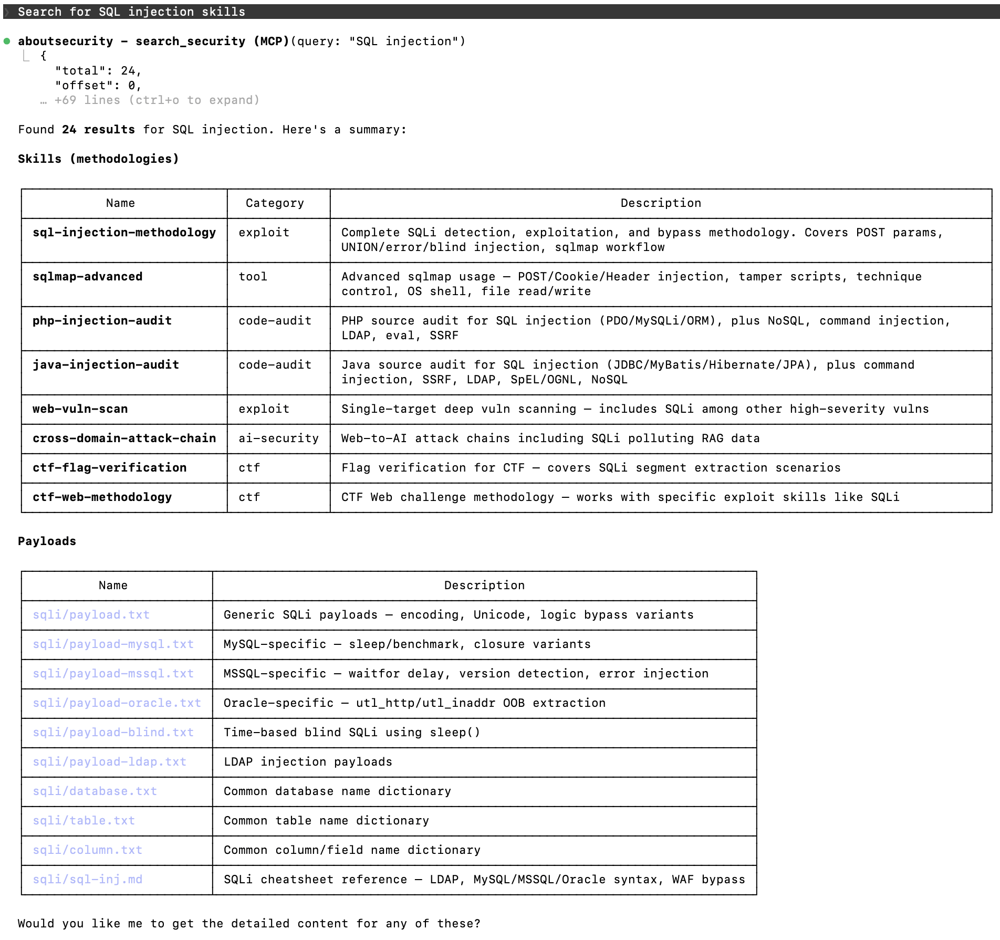
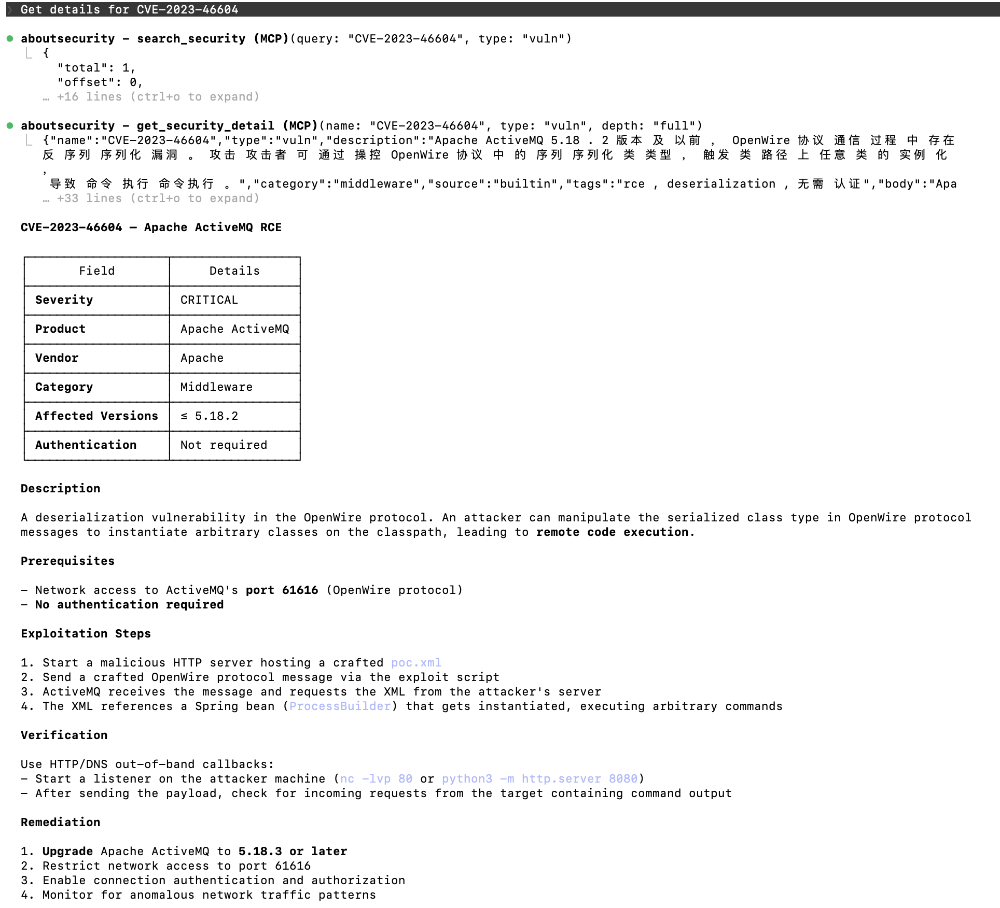
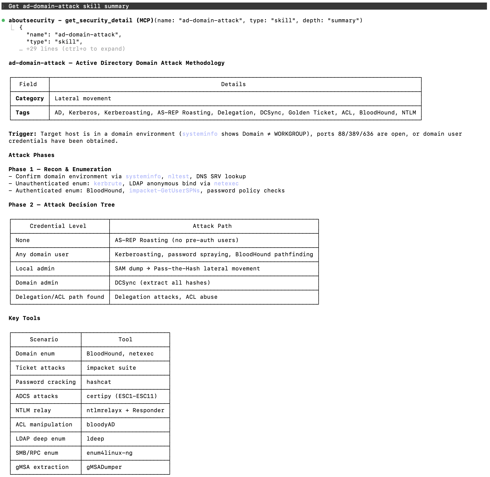

[中文文档](README.zh-CN.md) | English

# context1337 — AboutSecurity MCP Server

Standalone MCP resource service that turns [AboutSecurity](https://github.com/wgpsec/AboutSecurity) from a file repo into a consumable API. Like context7, but for security.

## Demo

**Search security resources**


**Vulnerability intelligence**


**AD domain attack skill detail**


## Quick Start

### Docker (recommended)

```bash
# Default: clones AboutSecurity from GitHub automatically
make docker

# Use local AboutSecurity repo (skip git clone, faster rebuild)
make docker-local
# or specify path:
make docker-local ABOUTSECURITY_LOCAL=../AboutSecurity

# Pin to a specific branch/tag
make docker-ref ABOUTSECURITY_REF=dev
```

```bash
docker run -p 1337:1337 -e ABOUTSECURITY_API_KEY=your-key context1337:latest
```

### Local Development (recommended for first-time users)

Only requires Go 1.25+ (gotip) and Python 3 installed on your machine.

```bash
git clone https://github.com/wgpsec/context1337.git
cd context1337

# One command does everything:
# 1. Clones AboutSecurity repo (if not already present)
# 2. Installs Python dependencies (jieba, pyyaml)
# 3. Builds FTS5 search index (builtin.db)
# 4. Compiles Go binary
# 5. Symlinks data directories
# 6. Starts the server
make run

# Build & run (requires data/ populated with builtin.db or AboutSecurity content)
make build
./absec serve --port 1337 --data-dir ./data  # default: --tool-mode lite
```

The server will be available at `http://localhost:1337`.

---

## MCP Client Configuration

### Claude Code (CLI)

```bash
# Add as user-level MCP server (available in all projects)
claude mcp add aboutsecurity --transport http --scope user http://localhost:1337/mcp

# Or project-level only (run from within your project directory)
claude mcp add aboutsecurity --transport http http://localhost:1337/mcp
```

If you set `ABOUTSECURITY_API_KEY` on the server, add the auth header:

```bash
claude mcp add aboutsecurity --transport http --header "Authorization: Bearer your-api-key" --scope user http://localhost:1337/mcp
```

After adding, restart Claude Code and run `/mcp` to verify the connection shows `connected`.

### Claude Desktop

Edit your Claude Desktop config file (`~/Library/Application Support/Claude/claude_desktop_config.json` on macOS):

```json
{
  "mcpServers": {
    "aboutsecurity": {
      "url": "http://localhost:1337/mcp",
      "headers": {
        "Authorization": "Bearer your-api-key"
      }
    }
  }
}
```

### Cursor

```json
{
  "mcpServers": {
    "aboutsecurity": {
      "serverUrl": "http://localhost:1337/mcp"
    }
  }
}
```

## Usage Examples

Once connected, just ask your AI assistant naturally:

**Search across all types**
- "Search for SQL injection resources" → `search_security(query="SQL injection")` finds skills and payloads
- "What XSS payloads are available?" → `search_security(query="XSS", type="payload")`
- "Show me all exploit skills" → `search_security(type="skill", category="exploit")`

**Get detailed knowledge**
- "Explain the SQL injection skill in detail" → `get_security_detail(name="sql-injection", type="skill", depth="full")` includes references
- "How does nmap scanning work?" → `get_security_detail(name="nmap-scan", type="skill")` returns methodology

**Read data files**
- "Show the top 100 passwords dictionary" → `read_security_file(path="Auth/password/Top100.txt", type="dict")`
- "Get XSS event handler payloads" → `read_security_file(path="XSS/events.txt", type="payload")`

**Search vulnerabilities**
- "Find critical Apache vulnerabilities" → `search_security(query="Apache", type="vuln", severity="CRITICAL")`
- "List all middleware vulnerabilities" → `search_security(type="vuln", category="middleware")`
- "Get the Log4j RCE vulnerability details" → `get_security_detail(name="CVE-2021-44228", type="vuln", depth="full")`

The AI will automatically call the right MCP tools to find relevant security knowledge.

## Available MCP Tools

Default mode is **lite** (3 tools). Use `--tool-mode full` for 12 per-type tools. If the AI model fails to invoke tools proactively, switch to full mode — the 12 fine-grained, domain-specific tools improve trigger rates.

### Lite mode (default, 3 tools)

| Tool | Description |
|------|-------------|
| `search_security` | Search or list all resource types (skill, dict, payload). To search vulnerabilities, specify type="vuln" explicitly (excluded from default search). Vuln supports severity and product filters. |
| `get_security_detail` | Get full detail for a skill (with depth control + references) or vulnerability (brief/full with PoC) |
| `read_security_file` | Read dictionary or payload file content with line-level pagination |

### Full mode (12 tools)

| Tool | Description |
|------|-------------|
| `search_skill` | Search penetration testing skills by keyword |
| `search_dicts` | Search password dictionaries by keyword |
| `search_payload` | Search attack payloads by keyword |
| `search_vuln` | Search vulnerability database by keyword with severity and product filters |
| `list_skills` | Browse all skills |
| `list_dicts` | Browse all dictionaries |
| `list_payloads` | Browse all payloads |
| `list_vulns` | List vulnerabilities with pagination (default 50), category/severity/product filters |
| `get_skill` | Get skill detail (with depth + references) |
| `get_dict` | Read dictionary file with line pagination |
| `get_payload` | Read payload file with line pagination |
| `get_vuln` | Get vulnerability detail by name (CVE/CNVD ID), brief or full depth with PoC |

## Makefile Targets

| Target | Description |
|--------|-------------|
| `make run` | Build + index + start server (first run auto-clones data) |
| `make build` | Compile Go binary only |
| `make index` | Build FTS5 search index only |
| `make test` | Run unit tests |
| `make test-integration` | Run integration tests |
| `make docker` | Build Docker image (clones AboutSecurity from GitHub) |
| `make docker-local` | Build Docker image using local AboutSecurity repo |
| `make docker-ref` | Build Docker image pinned to a specific branch/tag |
| `make clean` | Remove binary, databases, and symlinks |
| `make clean-benchmark` | Remove benchmark logs |

## REST API

| Endpoint | Description |
|----------|-------------|
| `GET /api/health` | Health check + resource count |
| `GET /api/stats` | Resource statistics by type/source |

## Environment Variables

| Variable | Default | Description |
|----------|---------|-------------|
| `ABOUTSECURITY_PORT` | `1337` | HTTP listen port |
| `ABOUTSECURITY_DATA_DIR` | `./data` | Data directory root |
| `ABOUTSECURITY_API_KEY` | (empty=no auth) | API key for Bearer auth |
| `ABOUTSECURITY_TOOL_MODE` | `lite` | Tool registration mode: `lite` (3 tools) or `full` (12 tools) |

## Architecture

```
Build time:   AboutSecurity/ → Python+jieba → builtin.db (FTS5 index)
Startup:      cp builtin.db → runtime.db, scan team/ → INSERT
Runtime:      MCP Streamable HTTP + REST API, pure Go tokenizer for new content
```
