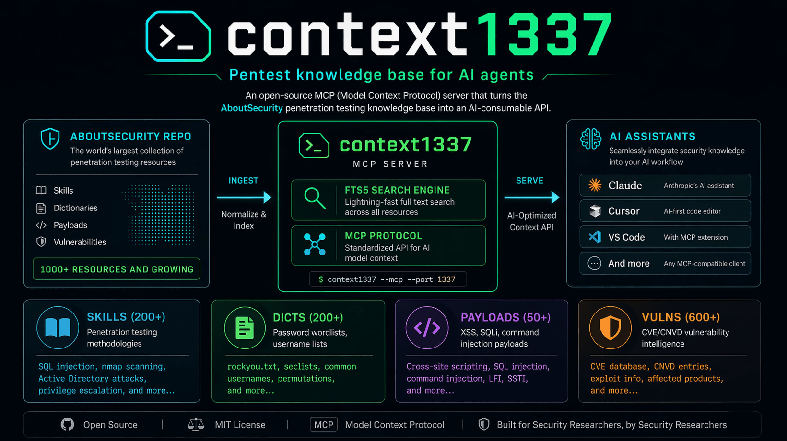
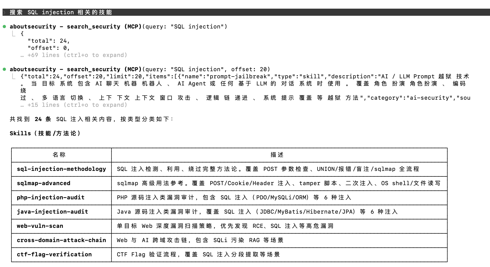
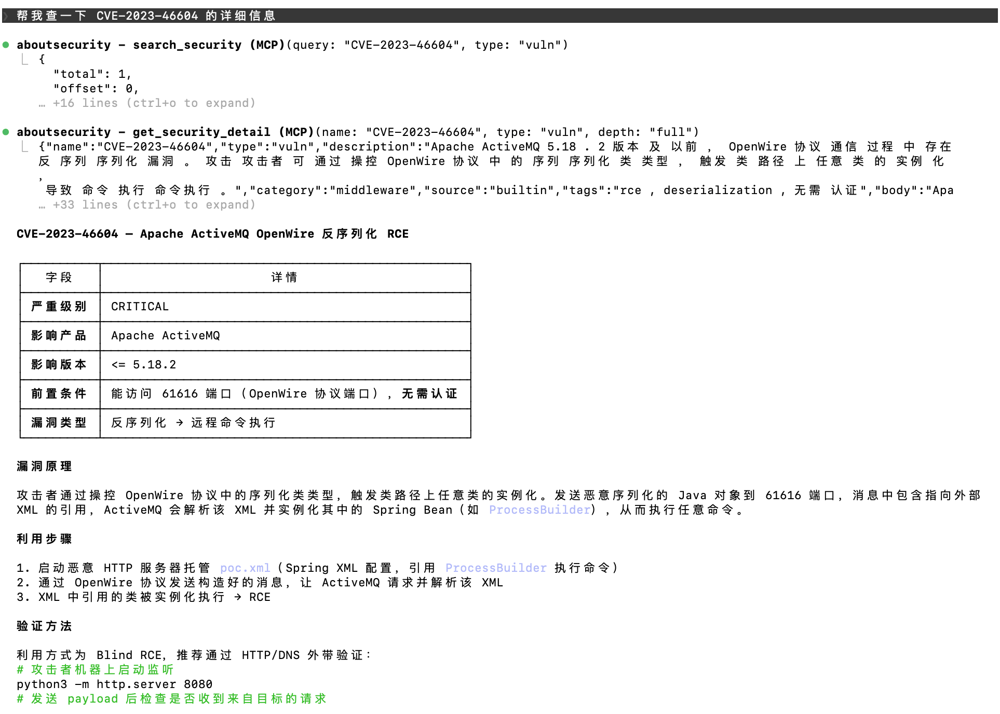
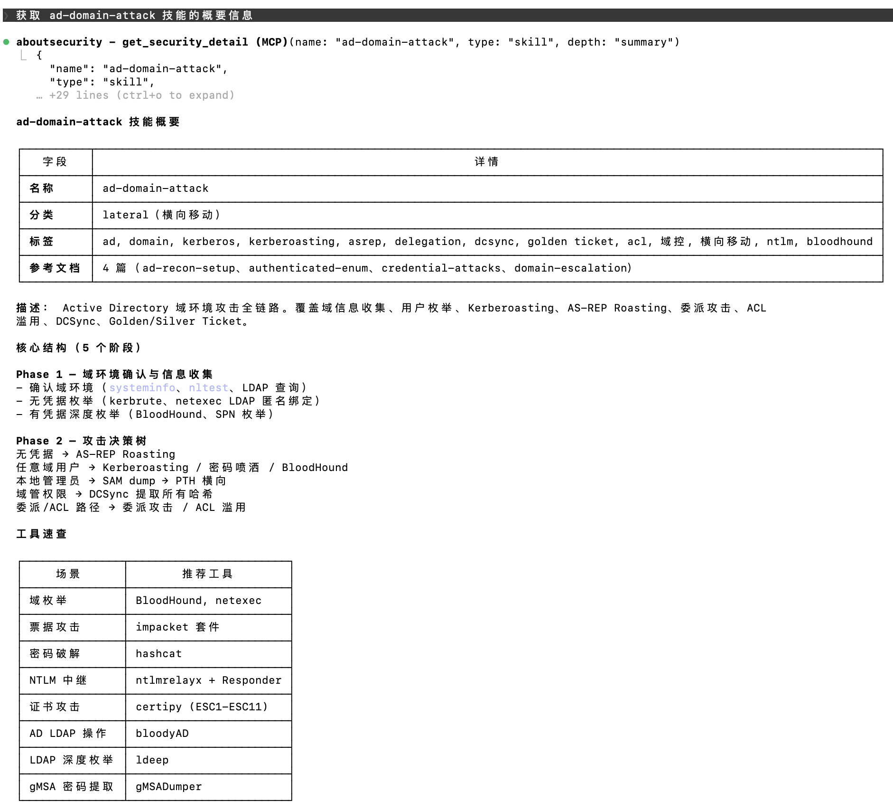

[English](README.md) | 中文文档



# context1337 — AboutSecurity MCP 服务

独立的 MCP 资源服务，将 [AboutSecurity](https://github.com/wgpsec/AboutSecurity) 从文件仓库转变为可消费的 API。类似 context7，但专为安全领域打造。

## 效果展示

**搜索安全资源**


**漏洞情报查询**


**AD 域攻击技能详情**


## 快速开始

### Docker（推荐）

```bash
# 默认：自动从 GitHub 克隆 AboutSecurity
make docker

# 使用本地 AboutSecurity 仓库（跳过 git clone，更快）
make docker-local
# 或指定路径：
make docker-local ABOUTSECURITY_LOCAL=../AboutSecurity

# 指定特定分支/标签
make docker-ref ABOUTSECURITY_REF=dev
```

```bash
docker run -p 1337:1337 -e ABOUTSECURITY_API_KEY=your-key context1337:latest
```

### 本地开发（推荐首次使用者）

仅需安装 Go 1.25+（gotip）和 Python 3。

```bash
git clone https://github.com/wgpsec/context1337.git
cd context1337

# 一条命令搞定一切：
# 1. 克隆 AboutSecurity 仓库（如果还没有）
# 2. 安装 Python 依赖（jieba、pyyaml）
# 3. 构建 FTS5 全文搜索索引（builtin.db）
# 4. 编译 Go 二进制文件
# 5. 创建数据目录软链接
# 6. 启动服务
make run

# 手动构建和运行
make build
./absec serve --port 1337 --data-dir ./data  # 默认：--tool-mode lite
```

服务启动后访问 `http://localhost:1337`。

---

## MCP 客户端配置

### Claude Code（CLI）

```bash
# 添加为用户级 MCP 服务（所有项目可用）
claude mcp add aboutsecurity --transport http --scope user http://localhost:1337/mcp

# 或仅项目级（在项目目录内运行）
claude mcp add aboutsecurity --transport http http://localhost:1337/mcp
```

删除用 `claude mcp remove aboutsecurity -s user`

如果服务端设置了 `ABOUTSECURITY_API_KEY`，需要添加认证头：

```bash
claude mcp add aboutsecurity --transport http --header "Authorization: Bearer your-api-key" --scope user http://localhost:1337/mcp
```

添加后重启 Claude Code，运行 `/mcp` 确认连接状态为 `connected`。

### Claude Desktop

编辑配置文件（macOS 路径：`~/Library/Application Support/Claude/claude_desktop_config.json`）：

```json
{
  "mcpServers": {
    "aboutsecurity": {
      "url": "http://localhost:1337/mcp",
      "headers": {
        "Authorization": "Bearer your-api-key"
      }
    }
  }
}
```

### Cursor

```json
{
  "mcpServers": {
    "aboutsecurity": {
      "serverUrl": "http://localhost:1337/mcp"
    }
  }
}
```

## 使用示例

连接后，直接用自然语言与 AI 助手对话：

**跨类型搜索**
- "搜索 SQL 注入相关资源" → `search_security(query="SQL injection")` 同时找到 skill、payload
- "有哪些 XSS payload？" → `search_security(query="XSS", type="payload")`
- "有哪些漏洞利用技能？" → `search_security(type="skill", category="exploit")`

**获取详细知识**
- "详细讲解 SQL 注入攻击技术" → 先搜索，再调用 `get_security_detail(id="absec://builtin/skill/sql-injection", depth="full")` 获取参考资料
- "nmap 扫描怎么做？" → `get_security_detail(id="absec://builtin/skill/nmap-scan")` 返回方法论
- "jenkins 的后渗透手段有哪些"

**读取数据文件**
- "给我常见弱口令字典前 100 行" → 先搜索，再调用 `read_security_file(id="absec://builtin/dict/Auth%2Fpassword%2FTop100.txt")`
- "XSS 事件触发的 payload 有哪些？" → `read_security_file(id="absec://builtin/payload/XSS%2Fevents.txt")`

**搜索漏洞**
- "查找 Apache 高危漏洞" → `search_security(query="Apache", type="vuln", severity="CRITICAL")`
- "列出所有中间件漏洞" → `search_security(type="vuln", category="middleware")`
- "获取 Log4j RCE 漏洞详情" → 先搜索，再调用 `get_security_detail(id="absec://builtin/vuln/CVE-2021-44228", depth="full")`

搜索结果会返回稳定 `id`，例如 `absec://builtin/skill/sql-injection`。推荐把这个 `id` 传给详情或文件读取工具，因为它保留了明确的数据源和资源身份。旧参数 `name`/`type`、`path`/`type` 仍然兼容，但当多个数据源存在同名资源时，`id` 可以避免歧义。

例如 `absec://builtin/vuln/CVE-2021-44228` 和 `absec://nuclei/vuln/CVE-2021-44228` 可以同时存在。`get_security_detail(name="CVE-2021-44228", type="vuln")` 无法指定来源，而稳定 ID 可以精确选择目标资源。

AI 会自动调用正确的 MCP 工具来查找相关安全知识。

## 可用 MCP 工具

默认为 **精简模式**（3 个工具）。使用 `--tool-mode full` 启用 12 个分类工具。如果 AI 模型未能主动调用工具，可切换到 full 模式，提供更细粒度的 12 个专用工具以提升触发率。

### 精简模式（默认，3 个工具）

| 工具 | 说明 |
|------|------|
| `search_security` | 搜索或列出所有资源类型（skill、dict、payload），结果包含稳定 `id`。搜索漏洞须显式指定 type="vuln"（默认搜索排除漏洞）。漏洞支持 severity 和 product 过滤 |
| `get_security_detail` | 通过稳定 `id`（推荐）或旧参数 `name` + `type` 获取 skill / vuln 详情 |
| `read_security_file` | 通过稳定 `id`（推荐）或旧参数 `path` + `type` 按行分页读取字典或 payload 文件内容 |

### 完整模式（12 个工具）

> 如果模型能力弱，或者触发不足，就用 full 模式，提供完整 mcp tool

| 工具 | 说明 |
|------|------|
| `search_skill` | 按关键词搜索渗透测试技能，结果包含稳定 `id` |
| `search_dicts` | 按关键词搜索密码字典，结果包含稳定 `id` |
| `search_payload` | 按关键词搜索攻击载荷，结果包含稳定 `id` |
| `search_vuln` | 按关键词搜索漏洞库，支持 severity 和 product 过滤，结果包含稳定 `id` |
| `list_skills` | 浏览所有技能，结果包含稳定 `id` |
| `list_dicts` | 浏览所有字典，结果包含稳定 `id` |
| `list_payloads` | 浏览所有载荷，结果包含稳定 `id` |
| `list_vulns` | 列出漏洞（默认 50 条），支持 category/severity/product 过滤，结果包含稳定 `id` |
| `get_skill` | 通过稳定 `id`（推荐）或旧 name 获取技能详情（支持 depth 和 references） |
| `get_dict` | 通过稳定 `id`（推荐）或旧 path 按行分页读取字典文件 |
| `get_payload` | 通过稳定 `id`（推荐）或旧 path 按行分页读取载荷文件 |
| `get_vuln` | 通过稳定 `id`（推荐）或旧 name 获取漏洞详情（CVE/CNVD ID），支持 brief/full 深度（含 PoC） |

## Makefile 命令

| 命令 | 说明 |
|------|------|
| `make run` | 构建 + 索引 + 启动服务（首次运行自动克隆数据） |
| `make build` | 仅编译 Go 二进制文件 |
| `make index` | 仅构建 FTS5 搜索索引 |
| `make test` | 运行单元测试 |
| `make test-integration` | 运行集成测试 |
| `make docker` | 构建 Docker 镜像（从 GitHub 克隆 AboutSecurity） |
| `make docker-local` | 使用本地 AboutSecurity 仓库构建镜像 |
| `make docker-ref` | 指定分支/标签构建镜像 |
| `make clean` | 清理二进制文件、数据库和软链接 |
| `make clean-benchmark` | 清理 benchmark 日志 |

## REST API

| 接口 | 说明 |
|------|------|
| `GET /api/health` | 健康检查 + 已启用资源计数 |
| `GET /api/stats` | 按类型/来源统计已启用资源 |
| `GET /api/resources` | 分页列表（含 enabled 状态，管理用） |
| `POST /api/resources` | 创建自定义资源（source 强制为 custom） |
| `PUT /api/resources/{id}` | 编辑自定义资源（仅 source=custom，否则 403） |
| `DELETE /api/resources/{id}` | 删除自定义资源（仅 source=custom，否则 403） |
| `PUT /api/resources/{id}/toggle` | 切换资源启用/禁用状态 |
| `PUT /api/resources/batch-toggle` | 按 type/category/source 批量切换 |

### 资源管理

资源表有 `enabled` 字段（默认 `1`）。禁用的资源在所有 MCP 工具查询（搜索、列表、详情）中不可见，但管理 API（`GET /api/resources`）仍可查看。

**切换单个资源：**
```bash
curl -X PUT http://localhost:1337/api/resources/42/toggle \
  -H "Authorization: Bearer $KEY" \
  -H "Content-Type: application/json" \
  -d '{"enabled": false}'
```

**批量切换（按分类/数据源）：**
```bash
curl -X PUT http://localhost:1337/api/resources/batch-toggle \
  -H "Authorization: Bearer $KEY" \
  -H "Content-Type: application/json" \
  -d '{"enabled": false, "filter": {"type": "skill", "category": "web"}}'
```

**创建自定义资源：**
```bash
curl -X POST http://localhost:1337/api/resources \
  -H "Authorization: Bearer $KEY" \
  -H "Content-Type: application/json" \
  -d '{"type": "skill", "name": "my-technique", "category": "web", "description": "...", "body": "..."}'
```

自定义资源的 `source` 由服务端强制设为 `custom`，可编辑和删除。内置资源不可修改或删除（返回 403）。

## 环境变量

| 变量 | 默认值 | 说明 |
|------|--------|------|
| `ABOUTSECURITY_PORT` | `1337` | HTTP 监听端口 |
| `ABOUTSECURITY_DATA_DIR` | `./data` | 数据目录根路径 |
| `ABOUTSECURITY_API_KEY` | （空=无认证） | Bearer 认证密钥 |
| `ABOUTSECURITY_TOOL_MODE` | `lite` | 工具注册模式：`lite`（3 个工具）或 `full`（12 个工具） |
| `NUCLEI_TEMPLATES_DIR` | （空=不启用） | nuclei-templates 仓库根目录，启用第二数据源 |
| `NUCLEI_MIN_SEVERITY` | `high` | nuclei CVE 最低导入级别：`critical`/`high`/`medium`/`low` |

## 数据源

### 默认数据源：AboutSecurity

服务启动时自动加载 [AboutSecurity](https://github.com/wgpsec/AboutSecurity) 仓库中的 skill、dict、payload、vuln 数据，构建 FTS5 全文搜索索引。这是唯一的必选数据源。

### 第二数据源：nuclei-templates（按需开启）

可选接入 [nuclei-templates](https://github.com/projectdiscovery/nuclei-templates) CVE 漏洞库，将模板中的 CVE 情报导入漏洞库，补充 AboutSecurity 的 CVE 覆盖范围。

**启用方式：**

```bash
# 命令行参数（推荐）
./absec serve --nuclei-dir /path/to/nuclei-templates

# 仅导入 critical 级别（默认 high，即 critical+high）
./absec serve --nuclei-dir /path/to/nuclei-templates --nuclei-min-severity critical

# 扩大范围到 medium
./absec serve --nuclei-dir /path/to/nuclei-templates --nuclei-min-severity medium

# 或通过环境变量
NUCLEI_TEMPLATES_DIR=/path/to/nuclei-templates ./absec serve
```

**参数说明：**

| 参数 | 说明 | 默认值 |
|------|------|--------|
| `--nuclei-dir` | nuclei-templates 仓库根目录路径，不传则不启用 | （空=不启用） |
| `--nuclei-min-severity` | 最低导入级别：`critical` \| `high` \| `medium` \| `low` | `high` |

默认导入 critical+high 共约 2,300 条 CVE 模板。

**注意：** nuclei-templates 仅在运行时数据库重建时扫描一次（首次启动或 builtin.db 版本升级时）。如果更换了 `--nuclei-dir` 或调整了 severity 参数，需手动删除 `data/runtime/runtime.db` 触发重建：

```bash
rm data/runtime/runtime.db
./absec serve --nuclei-dir /path/to/nuclei-templates
```

---

## 架构

```
构建阶段:   AboutSecurity/ → Python+jieba 分词 → builtin.db（FTS5 索引）
启动阶段:   复制 builtin.db → runtime.db，扫描 team/ → INSERT
            [可选] 扫描 nuclei-templates/http/cves/ → INSERT（source=nuclei）
运行阶段:   MCP Streamable HTTP + REST API，Go 原生分词器处理新内容
```

## WgpSec Agentic 生态

context1337 是 **WgpSec Agentic 生态** 的服务层 — 连接结构化安全知识与自主 AI Agent。

```
┌───────────────────── WgpSec Agentic Ecosystem ─────────────────────┐
│                                                                     │
│  知识 ➜ 服务 ➜ 执行 ➜ 验证                                          │
│                                                                     │
│  AboutSecurity ──▶ context1337 ──▶ tchkiller ──▶ benchmark-platform │
│                    (本仓库)         (渗透 Agent)    (CTF 靶场)       │
│                                         ▲                           │
│                                    破军 PoJun (通用求解引擎)         │
│                                                                     │
└─────────────────────────────────────────────────────────────────────┘
```

| 项目 | 定位 |
|------|------|
| [AboutSecurity](https://github.com/wgpsec/AboutSecurity) | 结构化渗透知识库（Skills、Dic、Payload、Vuln） |
| [context1337](https://github.com/wgpsec/context1337) | MCP Server — 将 AboutSecurity 转为 AI Agent 可检索的 API |
| [tchkiller](https://github.com/wgpsec/tchkiller) | 智能渗透测试 Agent，多轮决策 + 团队协作 |
| [benchmark-platform](https://github.com/wgpsec/benchmark-platform) | 浑象 CTF 靶场竞赛平台，评估 Agent 攻防能力 |
| [benchmark-challenges](https://github.com/wgpsec/benchmark-challenges) | 靶场数据仓库 — 通过 GitHub Releases 打包分发 |
| 破军 PoJun | 通用 AI 问题求解引擎（内部项目，未开源） |
